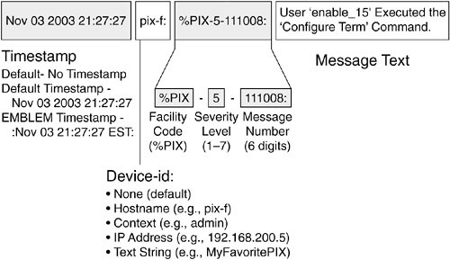
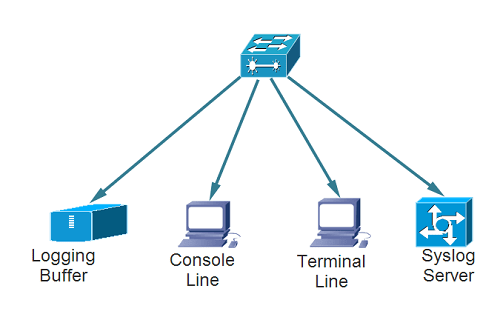

### sys logs 
sys log to minter system and network devices

### components of syslog servers
1. system log listener - the listener gather and process syslog data sent to UDP port 514.
2. A database- Syslog servers need database to store the massive amounts.
3. Management and filtering software

### Filtering specific:

Three different  layers with syslog standard 

1. Syslog content (information contained in an event message)
2. syslog application (generates, interprets , routes, store messages)
3. syslog transport(transmits the message)

### as

1. Syslog Servers
Syslog servers are used to send diagnostic and monitoring data. The data can then be analyzed for system monitoring, network maintenance and more.

### Syslog formate
> Priority, Version, Timestamp ,Hostname ,Application ,Process id,Message id

> <34>1 2003-10-11T22:14:15.003Z mymachine.example.com su - ID47 - BOM'su root' failed for lonvick on /dev/pts/8

> priority VERSION ISOTIMESTAMP HOSTNAME APPLICATION PID MESSAGEID STRUCTURED-DATA MSG

### Syslog messages:

ref: https://stackify.com/syslog-101/